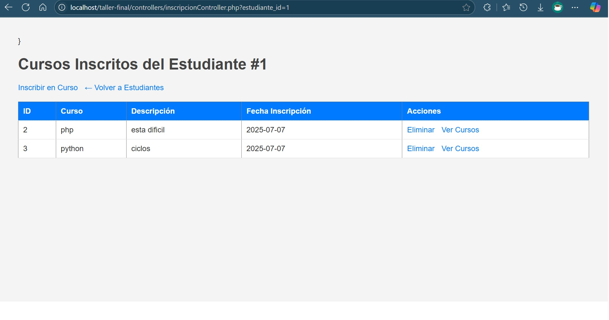

# Taller Evaluativo Final – PHP Puro + HTML + PDO

## Descripción General

Este proyecto consiste en una aplicación web desarrollada con PHP puro, HTML y PDO para MySQL. El objetivo principal es aplicar operaciones CRUD completas, implementando relaciones entre tablas y siguiendo una estructura modular basada en el patrón MVC (Modelo-Vista-Controlador).

El desarrollo se realizó sin frameworks, priorizando la claridad del código, la separación de responsabilidades y el cumplimiento de las buenas prácticas del desarrollo web.

---

## Tecnologías Utilizadas

- PHP 8.2
- HTML5 + CSS
- MySQL con PDO
- XAMPP como entorno de desarrollo local
- Git y GitHub para control de versiones

---

## Estructura del Proyecto

```
taller-final/
│
├── assets/
│   └── css/
│       └── style.css
│
├── config/
│   └── database.php
│
├── controllers/
│   ├── usuarioController.php
│   ├── cursoController.php
│   ├── leccionController.php
│   ├── estudianteController.php
│   └── inscripcionController.php
│
├── database/
│   └── taller_final.sql
│
├── models/
│   ├── Usuario.php
│   ├── Perfil.php
│   ├── Curso.php
│   ├── Leccion.php
│   ├── Estudiante.php
│   └── Inscripcion.php
│
└── views/
    ├── layouts/
    │   └── navbar.php
    ├── usuarios/
    ├── cursos/
    ├── lecciones/
    ├── estudiantes/
    └── inscripciones/
```

---

## Relaciones entre Tablas

- Uno a Uno (1:1): Usuarios y Perfiles  
- Uno a Muchos (1:N): Cursos y Lecciones  
- Muchos a Muchos (N:M): Estudiantes y Cursos (por medio de la tabla `inscripciones`)

---

## Funcionalidades

- Operaciones CRUD para:
  - Usuarios y sus perfiles
  - Cursos y sus lecciones
  - Estudiantes y sus inscripciones
- Relaciones correctamente implementadas en la base de datos con claves foráneas
- Formularios HTML para todas las operaciones
- Navegación entre secciones mediante un menú reutilizable
- Validación básica en el backend
- Estructura modular y código organizado

---

## Instalación

1. Clonar el repositorio:

```
git clone https://github.com/JeffryDev92/taller-final.git
```

2. Copiar el proyecto en la carpeta `htdocs` de XAMPP:

```
cp -r taller-final /c/xampp/htdocs/
```

3. Crear la base de datos desde phpMyAdmin e importar el archivo `taller_final.sql` que se encuentra en la carpeta `database`.

4. Acceder a la aplicación desde el navegador:

```
http://localhost/taller-final/controllers/usuarioController.php
```

---

## Capturas de Pantalla

<p align="center">
  
  
  
  
  
</p>


---

## Autor

Jeffry López Aguirre
Proyecto académico para evaluación final  
Desarrollador backend en formación  
[Perfil de GitHub](https://github.com/JeffryDev92)

---

## Licencia

Este proyecto fue desarrollado con fines académicos. Su uso está limitado al aprendizaje y evaluación.